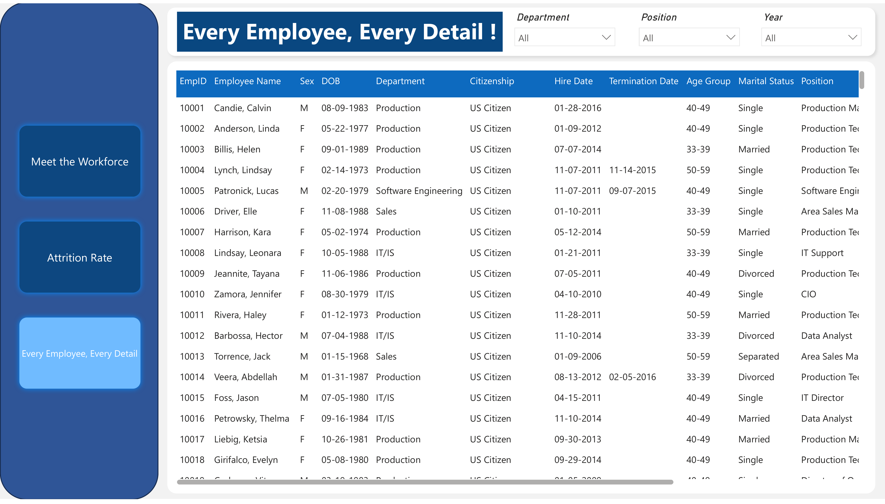
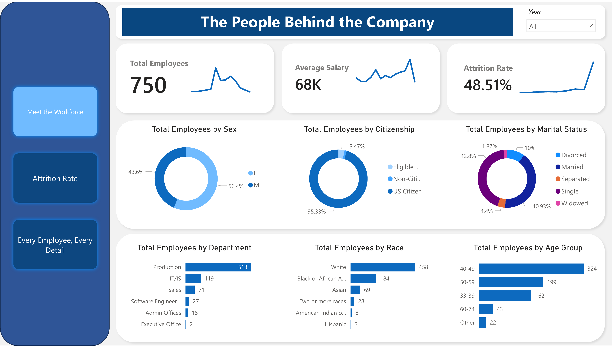
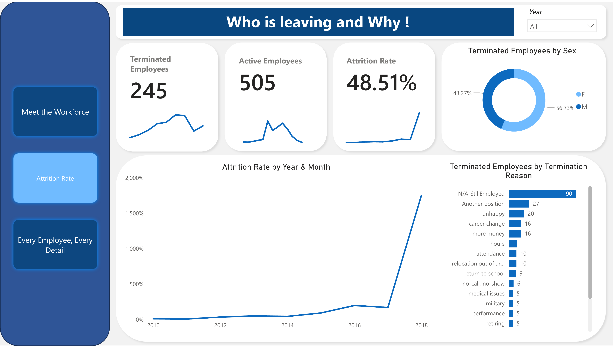

# Meet the Workforce - HR Analytics

## Project Overview
This project focuses on cleaning and analyzing an HR dataset to ensure data integrity and provide meaningful insights through a workforce dashboard. The dataset contains 311 employee records with 36 columns of demographic and employment information.

## Dashboards

### Workforce Overview

Provides a high-level view of the workforce distribution by department, marital status, and gender, along with key recruitment metrics.

### Leave & Resignation

Analyzes attrition rates, termination reasons, and demographic breakdown of employees who have left the company.

### Performance & Evaluation

Visualizes employee performance scores, satisfaction levels, and the relationship between tenure and performance across different managers and departments.

## Data Cleaning Process
The project involves a robust data cleaning pipeline implemented in Python, specifically addressing common issues found in HR Information Systems (HRIS):

1. **Date Standardization**: Standardizing various date formats (MM-DD-YYYY, MM-DD-YY, ISO) into uniform datetime objects for consistent analysis.
2. **Century Break Correction**: Identifying and fixing "future" dates caused by 2-digit year formats (e.g., '68' being parsed as 2068 instead of 1968).
3. **Temporal Logic Validation**:
    - Ensuring `DateofTermination` is not before `DateofHire`.
    - Validating that `LastPerformanceReview_Date` occurs after the `DateofHire`. Records violating this logic are flagged and corrected (set to `NaT`) to maintain data quality.

## Tech Stack
- **Python**: Core programming language.
- **Pandas**: For data manipulation and analysis.
- **NumPy**: For numerical operations.
- **PyMuPDF (fitz)**: For PDF image extraction.

## Files
- `Fixing_Data_Issues_in_HR_Dataset.ipynb`: Jupyter notebook containing the data cleaning logic.
- `Meet the Workforce- HR Analytics Report.pdf`: Original HR analytics report.
- `Meet the Workforce- HR Analytics.pdf`: Supplemental HR analytics documentation.
- `extract_images.py`: Utility script used to extract visuals from the PDF reports.
